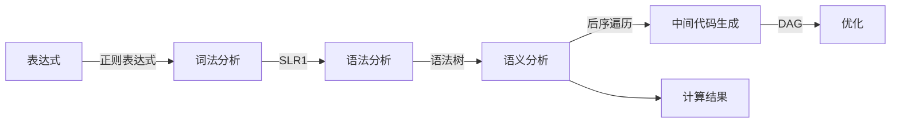

# PL/0 编译器

> For English Version, please refer to [README_ENG.md](README_ENG.md)

> 编译原理课程项目
>
> 小组成员：[刘元](https://github.com/LiuYuan-SHU), [林泽](https://github.com/BlankAino)

## 编译&运行

```bash
mkdir build
cd build
cmake .. && make
cd bin
./pl0_compiler
```

运行结果会置于`../build/output`中。如果想要查看正则表达式，可以运行`reg_patterns`。

## 项目运行逻辑与结构

### 项目逻辑



### 项目结构

```
.
├── CMakeLists.txt
├── README.md
├── README_ENG.md
├── data
├── source
└── test_files
```

* CMakeLists.txt: 顶层CMake文件
* README.md: 本文件
* README_ENG.md: 英文版README文件
* data: SLR(1)分析表
* source: 源文件
* test_files: 测试样例，共10个

### 头文件

```
.
├── DAG_optimizer.h
├── analysis_table.h
├── intermediate_code_generator.h
├── lexemes.h
├── lexical_analyzer.h
├── regex_pattern.h
├── semantic_analyzer.h
├── slr1.h
└── str_opekit.h
```

* DAG_optimizer.h: DAG优化器
* analysis_table.h: SLR(1)分析表读取器
* intermediate_code_generator.h: 中间代码生成器
* lexemes.h: PL/0保留字
* lexical_analyzer.h: 词法分析器
* regex_pattern.h: 基于PL/0的EBNF编写的正则表达式
* semantic_analyzer.h: 语义分析器
* slr1.h: 语法分析器
* str_opekit.h: 字符串操作工具包