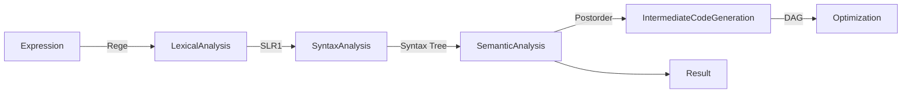

# PL/0 Compiler

> Assignment for Compile Principle
> 
> Group Member: [Yuan Liu](https://github.com/LiuYuan-SHU), [Ze Lin](https://github.com/BlankAino)

## Quick Start

```bash
mkdir build
cd build
cmake .. && make
cd bin
./pl0_compiler
```

The outputs will be placed in `../build/output`. If you want to check the regex patterns, you can run `reg_patterns`.

## The Logic and Structure of the Project

### Logic



### Structure

```
.
├── CMakeLists.txt
├── README.md
├── README_ENG.md
├── data
├── source
└── test_files
```

* CMakeLists.txt: Top-level CMake file
* README.md: Chinese version of README
* README_ENG.md: This file
* data: SLR(1) analysis table
* source: source files
* test_files: test files, 10 in total

### Header Files

```
.
├── DAG_optimizer.h
├── analysis_table.h
├── intermediate_code_generator.h
├── lexemes.h
├── lexical_analyzer.h
├── regex_pattern.h
├── semantic_analyzer.h
├── slr1.h
└── str_opekit.h
```

* DAG_optimizer.h: DAG optimizer
* analysis_table.h: SLR(1) analysis table
* intermediate_code_generator.h: intermediate code generator
* lexemes.h: lexemes
* lexical_analyzer.h: lexical analyzer
* regex_pattern.h: regex patterns
* semantic_analyzer.h: semantic analyzer
* slr1.h: SLR(1) analyzer
* str_opekit.h: string operation kit